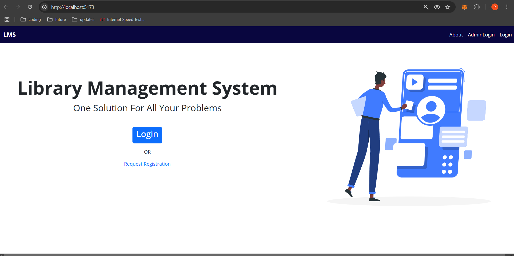
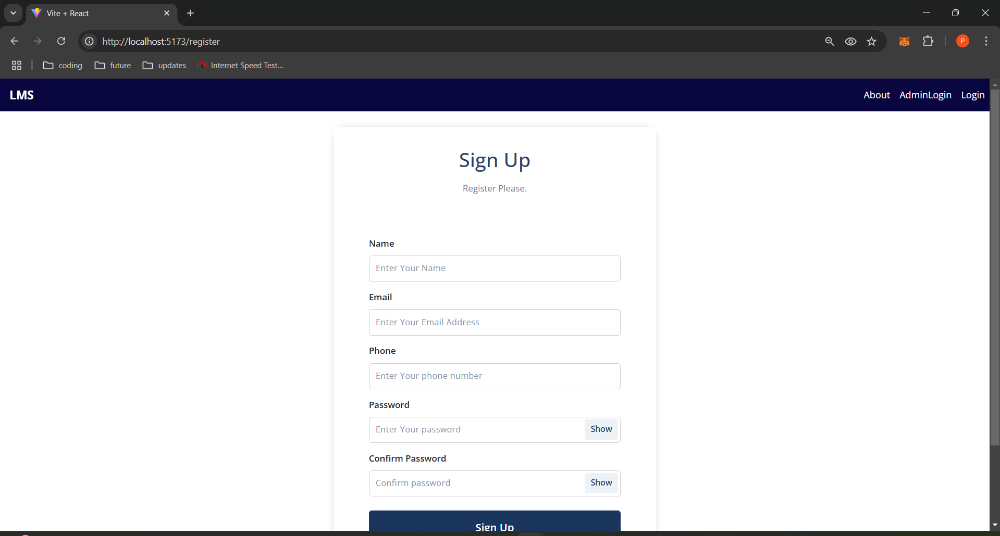
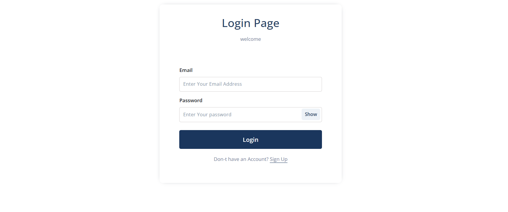
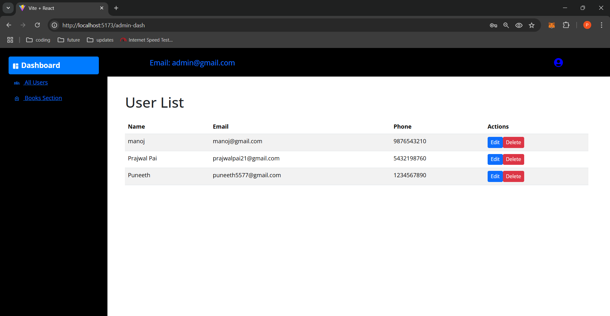
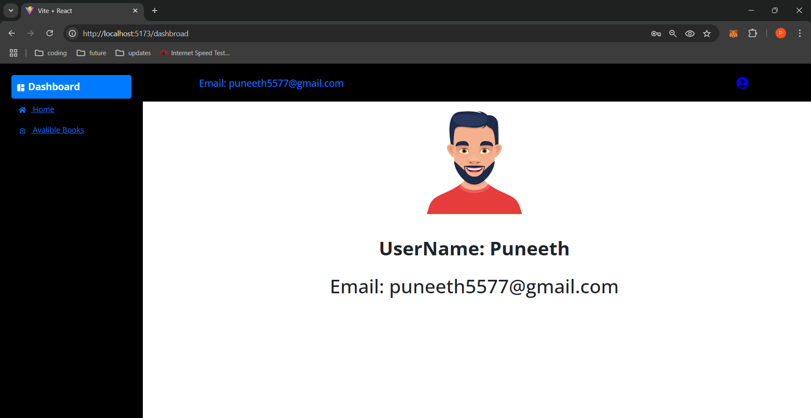
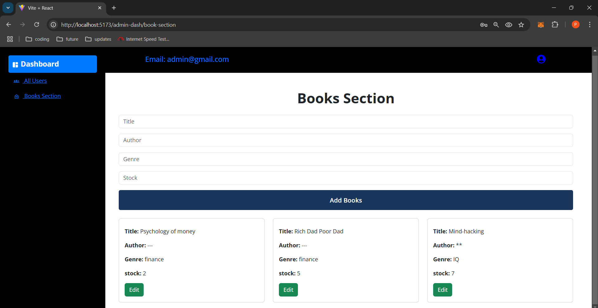
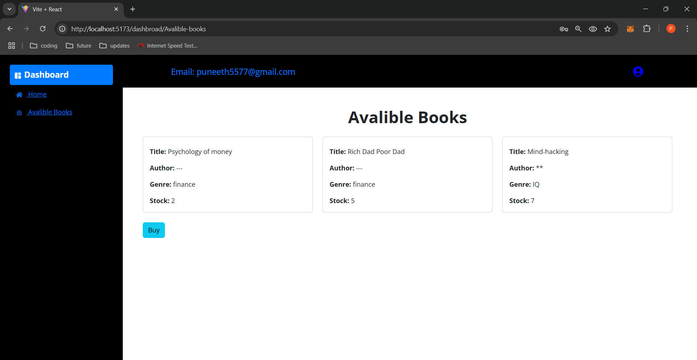

Developed a comprehensive Library Management System using the MERN stack, featuring token-based authentication for secure login and logout for both users and admin.
Designed an admin-controlled book section by enabling dynamic updates like add a new book or updating the content of already existing books and these books are visible to user in user dashboard.
Created a student dashboard to see the avaible books that are upload by the admin.

Steps to install
git clone <[repository-url](https://github.com/Puneeth5757/Library-Management-System)>
cd <project-folder>

cd backend
npm install

cd ../frontend
npm install
Create a .env file in the backend directory
Add this required environment variables
MONGO_URI=your_mongodb_connection_string
PORT=5000
JWT_SECRET=your_secret_key

npm run dev // for backend server
npm run dev // for frontend server

Screenshots

